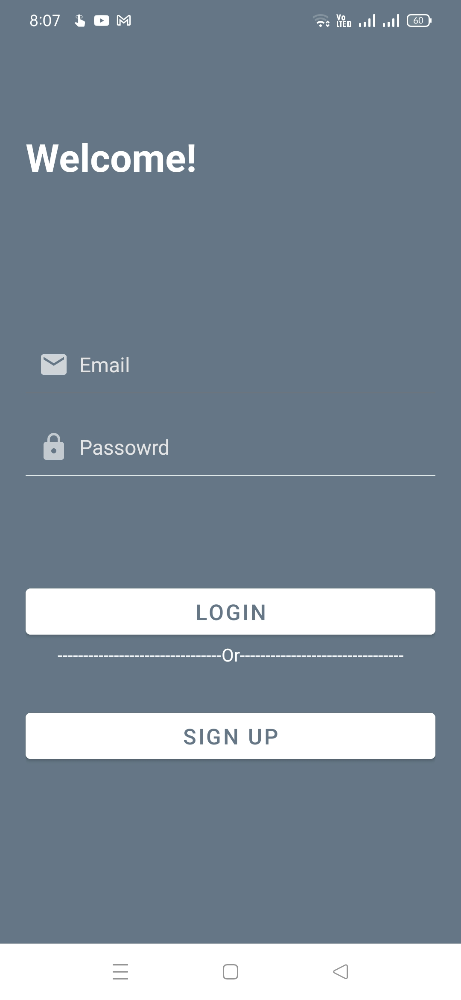
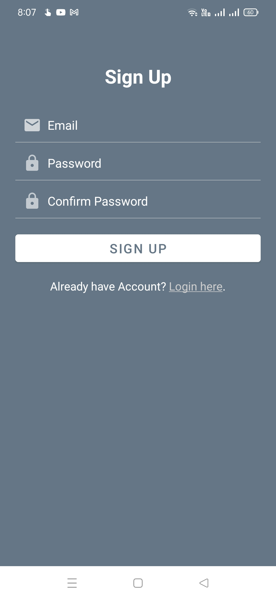
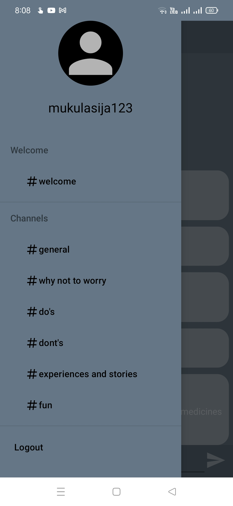
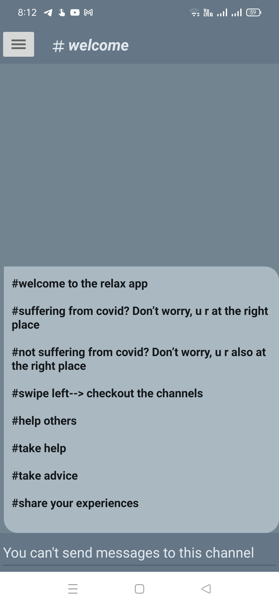
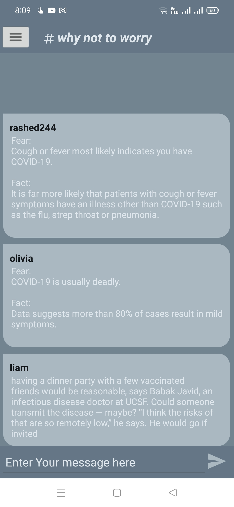
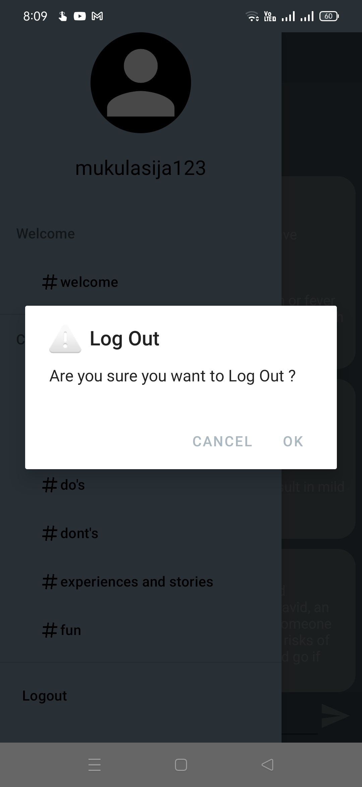

## Relax App
An Android application 📱 built using Kotlin,Firebase
-------------------

## ❤️ Try App
---------------
### Get Apk [Download here](https://drive.google.com/drive/folders/1dZWGQcxY-GsFRaXbKPndGivrUoZWMB-p)
------------
## ⚙️ Features
* App consists of Different Channels
* Talk to People in these channels
* You can switch users using the Login/Register
* You can help Covid Pateints
* Covid Patients Can take help from you
* Implemented login, register,edit password

## 🚀 Technology Used

* Relax App is build using Kotlin
* Firebase Realtime Database for chat channels
* Firebase Auth for Authentication


## 📸 Screenshots

||||
|:----------------------------------------:|:-----------------------------------------:|:-----------------------------------------: |
|  |  |  |
|  |  |  |

## ⚡ Dependencies Used
```sh
* Firebase Database
* Firebase Auth
```

